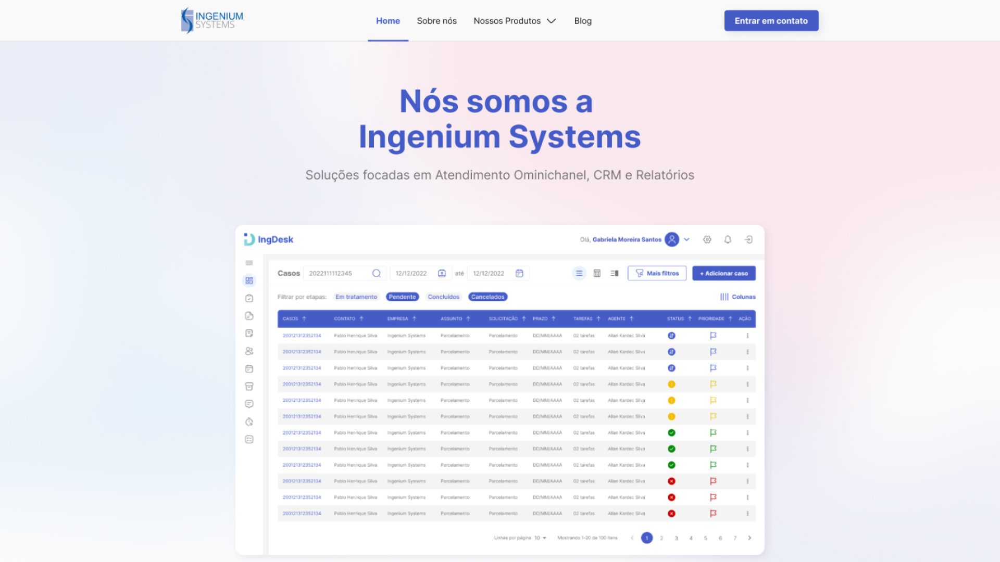

## Site Ingenium

Esse projeto possui objetivo de ser o Site a [Ingenium Systems](https://ingenium-systems.com.br/)

---

## Preview

<p align="center"></p>
---

## Design
Você pode ter acesso ao design pelo [link](https://www.figma.com/file/EgSsHtRn77uPKR0EhZKJUn/Site-Ingenium?node-id=133%3A715)

## Tecnologias

- [Atomic Design](https://bradfrost.com/)
- [Prismic CMS](https://prismic.io/)
- [Next.js](https://nextjs.org/)
- [Styled Components](https://styled-components.com/)
- [TypeScript](https://www.typescriptlang.org/)

---

### **Iniciando o projeto**

```bash
# Você precisa ter node na sua máquina para rodar o projeto
# Não lembra se possui o node? Execute node -v no seu terminal
$ node -v

# Execute yarn para instalar as dependências
$ yarn

# Execute yarn yarn dev para iniciar a aplicação
$ yarn dev

# A página será aberta em localhost na porta indicada no seu terminal

```